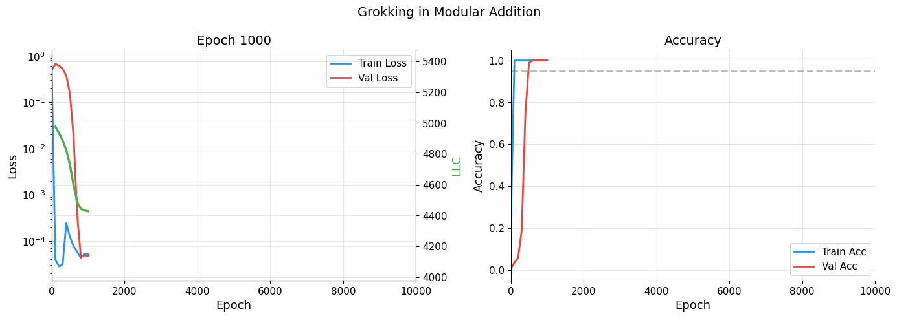
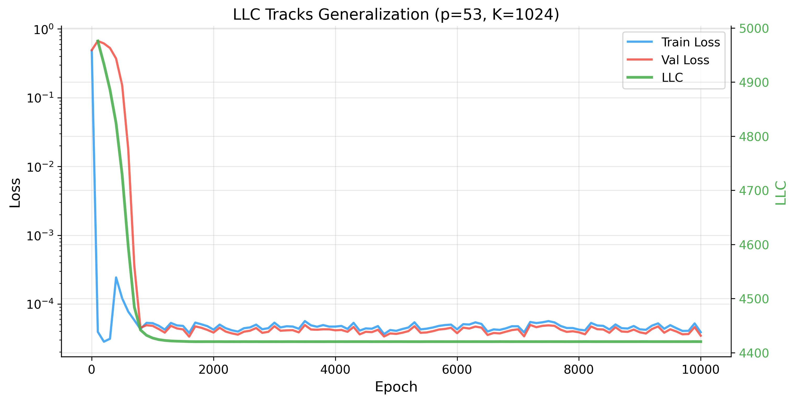
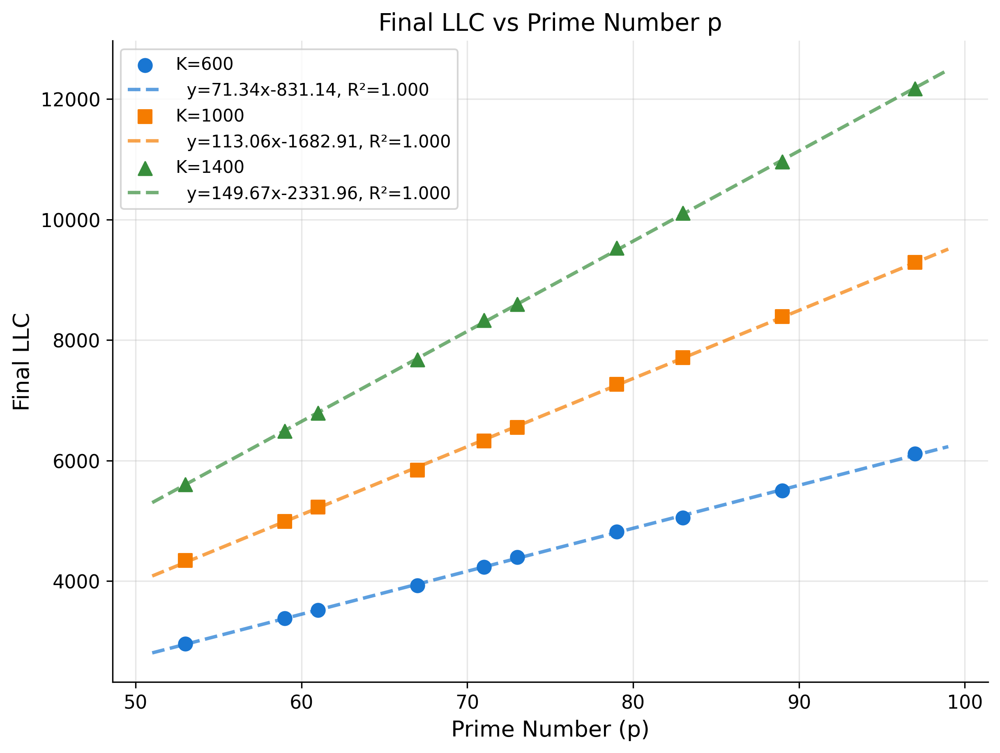
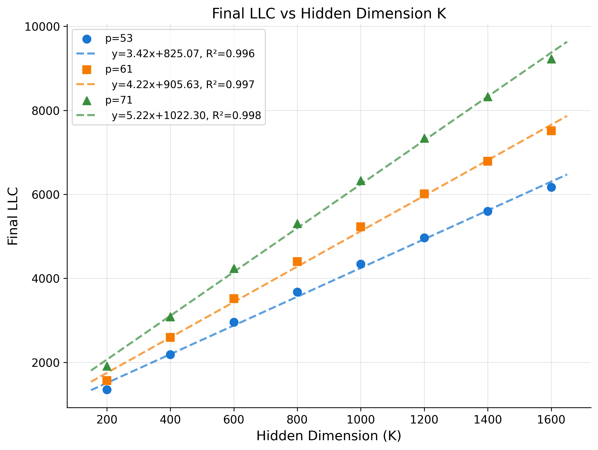
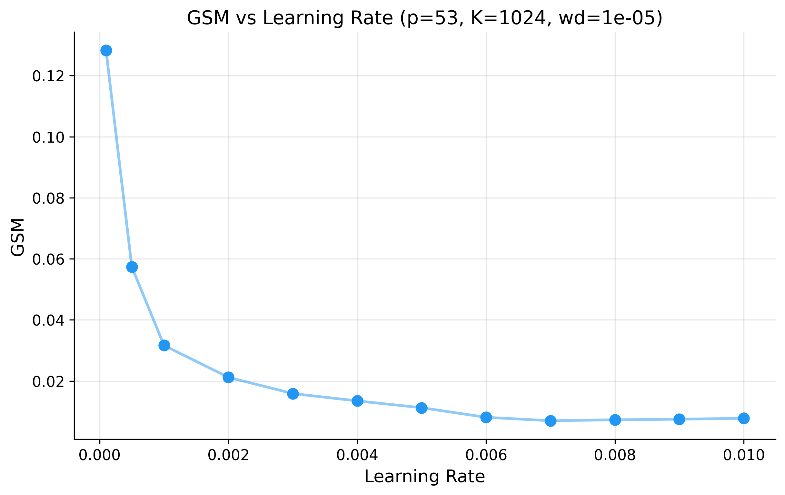
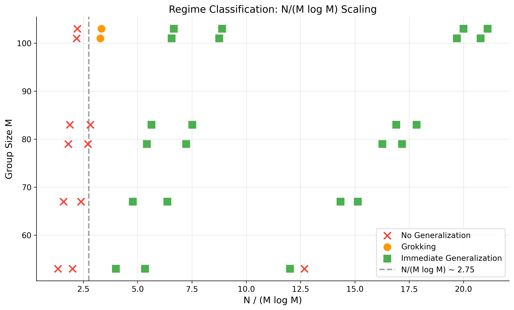
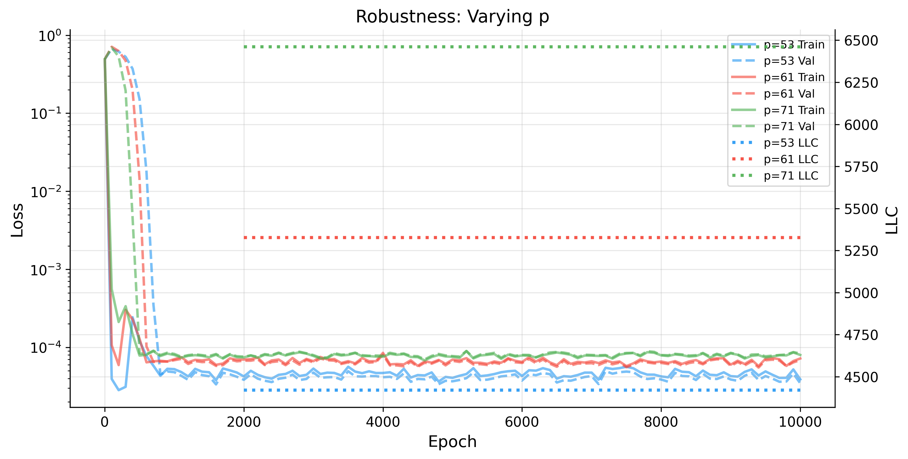
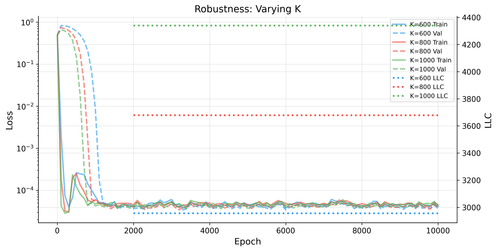
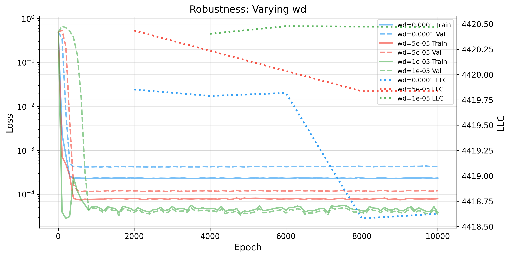
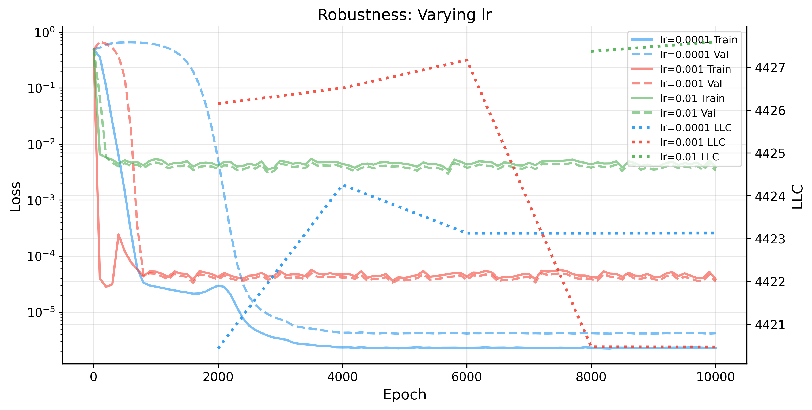

# Grokking as a Phase Transition (Cullen et al., 2026) -- Reproduction

Reproduction of ["Grokking as a Phase Transition between Competing Basins: a Singular Learning Theory Approach"](https://arxiv.org/abs/2603.01192) by Cullen, Estan-Ruiz, Danait, and Li (2026).



## Key Results

### LLC Tracks Generalisation (Figure 3)

The Local Learning Coefficient (LLC) peaks at 4976 during memorisation (epoch 100), then drops to 4420 as the model generalises, closely mirroring the validation loss curve. Paper reports peak ~4900 and convergence ~4300.



### Scaling Laws (Figures 1--2)

LLC scales linearly with both group size p and hidden dimension K, confirming Theorem 5.5.

| LLC vs p | LLC vs K |
|:---:|:---:|
|  |  |

**LLC vs p** (Figure 1): Linear fits with R^2 > 0.999 for all K values.

| K | Slope | R^2 | Paper slope |
|---|-------|-----|-------------|
| 600 | 71.34 | 0.9996 | 51.06 |
| 1000 | 113.06 | 0.9998 | 80.57 |
| 1400 | 149.67 | 0.9999 | 108.61 |

**LLC vs K** (Figure 2): Linear fits with R^2 > 0.996 for all p values.

| p | Slope | R^2 | Paper slope |
|---|-------|-----|-------------|
| 53 | 3.42 | 0.996 | 2.65 |
| 61 | 4.22 | 0.997 | 3.28 |
| 71 | 5.22 | 0.998 | 4.02 |

### Grokking Severity (Figure 4)

GSM decreases from 0.128 to 0.007 as learning rate increases from 0.0001 to 0.01, consistent with the paper's inverse relationship.



### Regime Classification (Figure 14)

Three regimes emerge as a function of N/(M log M): no generalisation, grokking, and immediate generalisation. The transition boundary is at ratio ~3.3, matching the paper's ~2.5--3.



### Robustness (Figures 7--10)

LLC tracking is robust across hyperparameters. The converged LLC (~4420 for p=53, K=1024) is stable regardless of weight decay or learning rate.

| Varying p (Fig 7) | Varying K (Fig 8) |
|:---:|:---:|
|  |  |

| Varying wd (Fig 9) | Varying lr (Fig 10) |
|:---:|:---:|
|  |  |

---

## Comparison with Paper

### Summary

| Figure | Paper Claim | Our Result | Match |
|--------|------------|------------|-------|
| Fig 1 | LLC linear in p | R^2 > 0.999 | Strong |
| Fig 2 | LLC linear in K | R^2 > 0.996 | Strong |
| Fig 3 | LLC tracks generalisation | Peak 4976, converged 4420 (paper: 4900, 4300) | Strong |
| Fig 4 | GSM decreases with lr | 0.128 to 0.007 | Strong |
| Fig 14 | Three regimes at N/(M log M) ~2.5--3 | Transition at ~3.3 | Good |
| Figs 7--10 | LLC robust across hyperparams | Consistent ~4420 | Strong |

**All qualitative scaling relationships are reproduced.** Absolute LLC values are systematically ~30--40% higher than the paper's. This is likely due to subtle differences in random initialisation, batch ordering, or devinterp version producing models with ~30% more effective neurons (K_eff).

### Implementation Notes

We used Adam with lr=0.001, coupled L2 weight decay (1e-5), and per-sample centered MSE loss. LLC was estimated using devinterp's SGLD sampler with default_nbeta(128) ~26.4, localization=5, SGLD lr=5e-4, 500 draws per chain, and 3 chains.

---

## Scope

This reproduction covers the main experimental results (Figures 1--4, 7--10, 14) for the quadratic network architecture. The following are out of scope:

- **Figure 5**: Illustrative loss landscapes (from Hoogland et al.)
- **Figure 6**: SGLD hyperparameter sensitivity analysis
- **Figures 11--12**: GSM and max-LLC sweeps across multiple weight decays
- **Figure 13**: Transformer architecture experiments

Absolute LLC values differ from the paper by a constant factor (~30%), likely due to differences in random initialisation or library versions. The scaling relationships (linearity in p and K, R^2 values) are faithfully reproduced.

---

## Setup

```bash
conda create -n kripke python=3.11
conda activate kripke
pip install -e ".[dev]"
```

## Usage

```bash
# Run all experiments (~7 hours on a single GPU)
python scripts/run_all.py --device cuda

# Run individual experiments
python scripts/run_llc_tracking.py --device cuda
python scripts/run_gsm.py --device cuda

# Regenerate figures from saved results
python scripts/generate_all_figures.py

# Run tests
pytest tests/ -v
```

## Model

- **Architecture**: f(x) = V sigma(W^T x), sigma(x) = x^2 (no bias, Kaiming init)
- **Loss**: Per-sample centered MSE = 0.5 * ||P_perp(Y - Y_hat)||^2_F / N
- **Optimizer**: Adam (lr=1e-3) + coupled L2 weight decay (wd=1e-5)
- **LLC**: devinterp SGLD with nbeta~26.4, localization=5, SGLD lr=5e-4, 3 chains, 500 draws

## Citation

```bibtex
@article{cullen2026grokking,
  title={Grokking as a Phase Transition between Competing Basins: a Singular Learning Theory Approach},
  author={Cullen, Ben and Estan-Ruiz, Sergio and Danait, Riya and Li, Jiayi},
  journal={arXiv preprint arXiv:2603.01192},
  year={2026}
}
```
